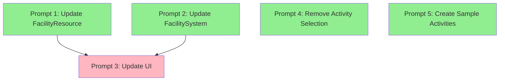

# Activity System Implementation - Parallel Task Prompts

This document contains prompts for implementing the new activity system across multiple Sonnet instances.
Each prompt is self-contained with all necessary context.

## Parallel Execution Guide
- **Can run in parallel:** Prompts 1, 2, 4, and 5
- **Sequential dependency:** Prompt 3 should run AFTER Prompts 1 & 2 complete
- **File conflict notes:** Coordinate if multiple instances edit the same file

---

## Prompt 1: Update FacilityResource to Use ActivityResource
**Can run in parallel with Prompts 2, 4, 5**

```
I need to update the Godot facility system to use ActivityResource. The project uses Godot 4 and follows strict patterns in CLAUDE.md.

Current situation:
- New ActivityResource at res://scripts/resources/activity_resource.gd with run_activity_on_creature function
- FacilityResource at res://scripts/resources/facility_resource.gd needs updating
- Facilities should store Array[ActivityResource] and run all activities during weekly updates

Tasks:
1. Read res://scripts/resources/activity_resource.gd to understand the interface
2. Update res://scripts/resources/facility_resource.gd to:
   - Add @export var activities: Array[ActivityResource] = []
   - Remove any old activity selection logic
   - Ensure proper @tool annotation and validation
3. Update facility .tres files in data/facilities/ to include activities array
4. Run preflight: godot --headless --scene tests/preflight_check.tscn

Key invariants from CLAUDE.md:
- Resource files must have @tool annotation
- Arrays must be typed (Array[ActivityResource])
- Resources must implement is_valid()
- No signals in Resource classes
```

---

## Prompt 2: Update FacilitySystem for Activity Processing
**Can run in parallel with Prompts 1, 4, 5**

```
I need to update the Godot FacilitySystem to process activities during weekly updates. The project uses Godot 4.

Current situation:
- New ActivityResource at res://scripts/resources/activity_resource.gd with run_activity_on_creature function
- FacilitySystem at res://scripts/systems/facility_system.gd handles weekly updates
- Activities should automatically run on assigned creatures each week

Tasks:
1. Read res://scripts/resources/activity_resource.gd and res://scripts/systems/facility_system.gd
2. Update FacilitySystem weekly processing to:
   - Iterate through each facility's activities array
   - Call activity.run_activity_on_creature() for each assigned creature
   - Remove any activity selection prompts/dialogs
3. Ensure WeeklyUpdateOrchestrator properly triggers facility updates
4. Run test: godot --headless --scene tests/individual/test_facility.tscn

Key patterns:
- System access: GameCore.get_system("facility")
- Use SignalBus for events (no new signal wrappers)
- Weekly events via TimeSystem
```

---

## Prompt 3: Update FacilityCard UI for Stat Display
**Must run AFTER Prompts 1 & 2 complete**

```
I need to update the Godot FacilityCard UI to show stat changes from training activities. The project uses Godot 4.

Current situation:
- FacilityCard scene at res://scenes/ui/components/facility_card.tscn has been updated with stat display area
- Need to show +/- stat changes from facility activities using abbreviations
- Food button still exists but activities are automatic now

Tasks:
1. Read res://scripts/ui/facility_card.gd controller
2. Update facility_card.gd to:
   - Calculate total stat changes from all facility activities
   - Display abbreviated stats (STR, AGI, INT, etc.) with +/- values
   - Keep display compact in the existing container
   - Remove/hide any activity selection UI (activities are automatic)
3. Use format like "STR +2 AGI +1" for stat display
4. Test UI: godot --headless --scene scenes/ui/facility_view.tscn --quit-after 3

UI patterns:
- Controllers end with _controller.gd
- UI updates via SignalBus events
- Abbreviations: STR (strength), AGI (agility), INT (intelligence), END (endurance), FOC (focus)
```

---

## Prompt 4: Remove Activity Selection Dialogs
**Can run in parallel with Prompts 1, 2, 5**

```
I need to remove activity selection UI from the Godot facility system since activities are now automatic. The project uses Godot 4.

Current situation:
- ActivitySelectionPopup at res://scenes/ui/components/activity_selection_popup.tscn is no longer needed
- Controller at res://scripts/ui/activity_selection_popup_controller.gd is obsolete
- Facilities now automatically run all linked activities

Tasks:
1. Check for references to activity_selection_popup in:
   - res://scripts/ui/facility_view_controller.gd
   - res://scripts/ui/facility_assignment_dialog_controller.gd
   - Any other UI controllers
2. Remove activity selection logic and UI calls
3. Delete or comment out obsolete files (keep for reference if unsure)
4. Ensure facility assignment still works without activity selection
5. Run UI test: godot --headless --scene scenes/ui/overlay_menu.tscn --quit-after 3

Important:
- Don't break facility creature assignment
- Food selection should still work
- Keep all other facility functionality intact
```

---

## Prompt 5: Create Sample Activities
**Can run independently**

```
I need to create sample ActivityResource files for a Godot facility system. The project uses Godot 4.

Current situation:
- ActivityResource class at res://scripts/resources/activity_resource.gd
- Need .tres files for different training activities
- Activities have run_activity_on_creature function that modifies creature stats

Tasks:
1. Read res://scripts/resources/activity_resource.gd to understand the structure
2. Create activity .tres files in data/activities/ directory:
   - strength_training.tres (increases strength)
   - agility_training.tres (increases agility)
   - intelligence_training.tres (increases intelligence)
   - balanced_training.tres (small increases to multiple stats)
3. Each activity should:
   - Have proper script_class reference
   - Include stat modifiers
   - Have descriptive names and descriptions
   - Follow Godot .tres format with load_steps
4. Validate resources load: godot --check-only project.godot

Resource format requirements:
- Must use @tool annotation in script
- Must have proper [gd_resource] header
- Arrays must be typed
- All @export properties must be set
```

---

## Implementation Order & Dependencies



**Legend:**
- 🟢 Green: Can start immediately (parallel)
- 🔴 Pink: Has dependencies (sequential)

## Expected Outcomes

After all prompts are completed:
1. Facilities will have an activities array that automatically runs each week
2. No more activity selection dialogs - activities are predetermined per facility
3. Facility cards will show stat changes from training (e.g., "STR +2 AGI +1")
4. Sample activities will be available for testing
5. All tests should pass with the new system

## Testing Order

1. Run preflight after each prompt completes
2. Test facility system: `godot --headless --scene tests/individual/test_facility.tscn`
3. Test UI updates: `godot --headless --scene scenes/ui/facility_view.tscn --quit-after 3`
4. Full test suite: `godot --headless --scene tests/test_all.tscn`