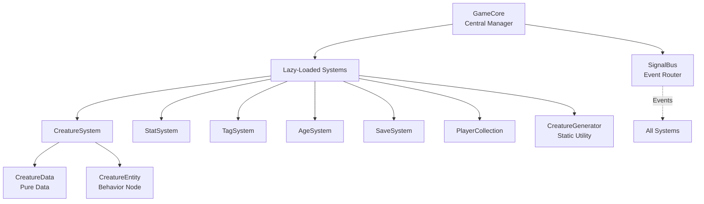

# Systems Integration Guide

**Purpose**: Document how all Stage 1 systems work together and depend on each other, providing clear integration patterns and workflows for future development.

**Created**: 2024-12-26 - Based on completed Stage 1 Tasks 1-8
**Status**: Stage 1 Core Systems (8/11 complete)

---

## 🏗️ System Architecture Overview



## 📋 System Dependency Matrix

| System | Depends On | Used By | Signals Emitted |
|--------|------------|---------|-----------------|
| **GameCore** | None | All Systems | None |
| **SignalBus** | GameCore | All Systems | None (routes others) |
| **CreatureData** | None | All Systems | None (pure data) |
| **CreatureEntity** | CreatureData, SignalBus | Game Logic | Via SignalBus |
| **StatSystem** | GameCore | TagSystem, AgeSystem, Quests | None directly |
| **TagSystem** | GameCore, SignalBus | PlayerCollection, Quests | 4 tag signals |
| **AgeSystem** | GameCore, SignalBus, CreatureData | SaveSystem, Time | 3 age signals |
| **CreatureGenerator** | TagSystem, CreatureData | PlayerCollection, Shop | None (utility) |
| **SaveSystem** | GameCore, All Systems | Main Game Loop | 2 save signals |
| **PlayerCollection** | All Above Systems | UI, Quests | 5 collection signals |

---

## 🔄 Core Integration Workflows

### 1. Creating a New Creature
```gdscript
# Step 1: Generate creature data
var creature: CreatureData = CreatureGenerator.generate_creature_data("scuttleguard")

# Step 2: Customize properties
creature.creature_name = "Scout"
creature.tags.append("Trained")

# Step 3: Add to collection (triggers signals)
var collection = GameCore.get_system("collection")
if not collection.add_to_active(creature):  # Try active roster first
    collection.add_to_stable(creature)       # Fallback to stable

# Signals automatically emitted:
# - creature_acquired(creature, "generated")
# - active_roster_changed(roster) OR stable_collection_updated("added", id)
```

### 2. Quest Creature Selection
```gdscript
# Step 1: Get quest requirements
var required_tags: Array[String] = ["Dark Vision", "Small"]
var excluded_tags: Array[String] = ["Flies"]

# Step 2: Find eligible creatures
var collection = GameCore.get_system("collection")
var available: Array[CreatureData] = collection.get_available_for_quest(required_tags)

# Step 3: Filter further if needed
var tag_system = GameCore.get_system("tag")
var best_matches: Array[CreatureData] = []
for creature in available:
    if tag_system.meets_tag_requirements(creature, required_tags, excluded_tags):
        best_matches.append(creature)

# Step 4: Sort by performance (considers age modifiers)
best_matches.sort_custom(func(a, b):
    return a.get_performance_score() > b.get_performance_score()
)
```

### 3. Aging and Time Progression
```gdscript
# Weekly time progression workflow
func advance_week():
    var collection = GameCore.get_system("collection")
    var age_system = GameCore.get_system("age")
    var save_system = GameCore.get_system("save")

    # Step 1: Get all creatures
    var all_creatures: Array[CreatureData] = []
    all_creatures.append_array(collection.get_active_creatures())
    all_creatures.append_array(collection.get_stable_creatures())

    # Step 2: Age them (batch operation)
    age_system.age_all_creatures(all_creatures, 1)

    # Signals automatically emitted:
    # - creature_category_changed() for transitions
    # - creature_expired() for deaths
    # - aging_batch_completed(count, weeks)

    # Step 3: Auto-save after aging
    save_system.trigger_auto_save()
```

### 4. Save/Load Game State
```gdscript
# Complete save workflow
func save_game(slot_name: String):
    var save_system = GameCore.get_system("save")
    var collection = GameCore.get_system("collection")

    # Step 1: Save game state (includes system states)
    save_system.save_game_state(slot_name)

    # Step 2: Save creature collections
    var all_creatures: Array[CreatureData] = []
    all_creatures.append_array(collection.get_active_creatures())
    all_creatures.append_array(collection.get_stable_creatures())
    save_system.save_creature_collection(all_creatures, slot_name)

    # Signals emitted:
    # - save_started(slot_name)
    # - save_completed(slot_name)

# Complete load workflow
func load_game(slot_name: String):
    var save_system = GameCore.get_system("save")
    var collection = GameCore.get_system("collection")

    # Step 1: Load game state
    save_system.load_game_state(slot_name)

    # Step 2: Load and restore creatures
    var creatures: Array[CreatureData] = save_system.load_creature_collection(slot_name)
    collection.restore_from_save(creatures)

    # Signals emitted:
    # - load_completed(slot_name)
```

---

## 🎯 System Communication Patterns

### Pattern 1: Direct System Calls
Used when one system needs immediate data from another.

```gdscript
# TagSystem directly validates creature tags
var tag_system = GameCore.get_system("tag")
if tag_system.validate_tag_combination(creature.tags):
    # Tags are valid
```

### Pattern 2: Signal-Based Communication
Used for decoupled event notification.

```gdscript
# PlayerCollection emits signal when roster changes
signal_bus.emit_active_roster_changed(roster)

# UI listens and updates display
func _on_active_roster_changed(roster: Array[CreatureData]):
    update_roster_display(roster)
```

### Pattern 3: Lazy System Loading
Systems are loaded only when first accessed.

```gdscript
# First access loads and caches the system
var collection = GameCore.get_system("collection")  # Loads if needed
var collection2 = GameCore.get_system("collection") # Returns cached instance
```

### Pattern 4: Data-First Architecture
CreatureData is passed between systems, not CreatureEntity.

```gdscript
# Systems work with data, not entities
func process_creature(creature_data: CreatureData):
    var age_system = GameCore.get_system("age")
    age_system.age_creature_by_weeks(creature_data, 1)  # Works with data

    # Only create entity when behavior needed
    if needs_behavior:
        var entity = CreatureEntity.new()
        entity.data = creature_data
```

---

## 🔐 System Initialization Order

Systems can be loaded in any order due to lazy loading, but conceptually:

1. **GameCore** - Always first (autoload)
2. **SignalBus** - Loaded by GameCore immediately
3. **StatSystem** - Independent, loaded when needed
4. **TagSystem** - May load StatSystem for validation
5. **AgeSystem** - Depends on creature data structure
6. **CreatureGenerator** - Static, uses TagSystem when available
7. **SaveSystem** - Can save any loaded system's state
8. **PlayerCollection** - Integrates all above systems

---

## 🎮 Common Integration Scenarios

### Scenario 1: Shop Purchase
```gdscript
func purchase_creature(species: String, egg_type: String):
    # Generate with specific quality
    var algorithm = CreatureGenerator.GenerationType.HIGH_ROLL if egg_type == "premium" else CreatureGenerator.GenerationType.LOW_ROLL
    var creature: CreatureData = CreatureGenerator.generate_creature_data(species, algorithm)

    # Add to collection
    var collection = GameCore.get_system("collection")
    collection.add_to_stable(creature)

    # Signal emitted: creature_acquired(creature, "shop")
    # UI and save system respond to signal
```

### Scenario 2: Training Session
```gdscript
func train_creature(creature: CreatureData, stat: String):
    var stat_system = GameCore.get_system("stat")

    # Apply training with age modifier
    var base_gain: int = 10
    var age_modifier: float = creature.get_age_modifier()
    var actual_gain: int = int(base_gain * age_modifier)

    # Update stat
    var current: int = creature.get_stat(stat)
    creature.set_stat(stat, current + actual_gain)

    # Emit signal for UI update
    var signal_bus = GameCore.get_signal_bus()
    signal_bus.emit_creature_stat_changed(creature, stat, actual_gain)
```

### Scenario 3: Competition Entry
```gdscript
func evaluate_for_competition(creature: CreatureData, competition_type: String) -> float:
    # Get base stats
    var stats: Dictionary = {
        "STR": creature.get_stat("STR"),
        "DEX": creature.get_stat("DEX"),
        "INT": creature.get_stat("INT")
    }

    # Apply age modifiers for competition
    var age_modifier: float = creature.get_age_modifier()
    for stat in stats:
        stats[stat] = int(stats[stat] * age_modifier)

    # Check tag bonuses
    var tag_system = GameCore.get_system("tag")
    var bonus: float = 1.0
    if competition_type == "aerial" and creature.has_tag("Flies"):
        bonus = 1.2

    # Calculate final score
    var score: float = 0.0
    match competition_type:
        "strength": score = stats["STR"] * bonus
        "agility": score = stats["DEX"] * bonus
        "puzzle": score = stats["INT"] * bonus

    return score
```

---

## 🔧 System Extension Points

### Adding New Systems (Tasks 9-11)
When implementing remaining Stage 1 systems:

1. **Create System Class**
```gdscript
extends Node
class_name NewSystem

func _init() -> void:
    print("NewSystem initialized")
```

2. **Add to GameCore**
```gdscript
# In GameCore._load_system()
match system_name:
    "new_system":
        system = preload("res://scripts/systems/new_system.gd").new()
```

3. **Add SignalBus Signals**
```gdscript
# In SignalBus
signal new_system_event(data: Variant)

func emit_new_system_event(data: Variant) -> void:
    if _validate_not_null(data, "new_system_event"):
        new_system_event.emit(data)
```

4. **Integrate with Existing Systems**
```gdscript
# In systems that need the new functionality
var new_system = GameCore.get_system("new_system")
new_system.do_something(creature_data)
```

---

## 📊 Performance Considerations

### System Loading Performance
- Lazy loading prevents startup overhead
- Systems cached after first access
- No circular dependencies due to GameCore mediation

### Signal Performance
- Validation adds ~0-1ms overhead per emission
- Batch operations should use single signal with array data
- Debug mode affects performance (disable in production)

### Data Access Performance
- Direct property access on CreatureData is fastest
- Method calls add minimal overhead
- Avoid repeated system lookups in loops

```gdscript
# INEFFICIENT - Multiple lookups
for creature in creatures:
    GameCore.get_system("age").process(creature)
    GameCore.get_system("tag").validate(creature)

# EFFICIENT - Cache system references
var age_system = GameCore.get_system("age")
var tag_system = GameCore.get_system("tag")
for creature in creatures:
    age_system.process(creature)
    tag_system.validate(creature)
```

---

## 🚀 Quick Integration Checklist

When integrating systems:

- [ ] Load required systems via `GameCore.get_system()`
- [ ] Connect to relevant signals if reactive behavior needed
- [ ] Use CreatureData for data passing, not CreatureEntity
- [ ] Validate data before system calls
- [ ] Handle null returns and error cases
- [ ] Emit appropriate signals after state changes
- [ ] Consider performance for batch operations
- [ ] Test with both empty and full collections
- [ ] Verify save/load compatibility
- [ ] Update documentation with integration patterns

---

## 📚 See Also

- [API_REFERENCE.md](API_REFERENCE.md) - Complete method signatures and properties
- [CLAUDE.md](../../CLAUDE.md) - Architecture decisions and lessons learned
- [tests/README.md](../../tests/README.md) - Testing patterns and examples
- Individual system documentation in `docs/implementation/stages/stage_1/`

---

**This guide shows how Stage 1 systems work together. Reference it when implementing new features or systems that need to integrate with existing functionality.**